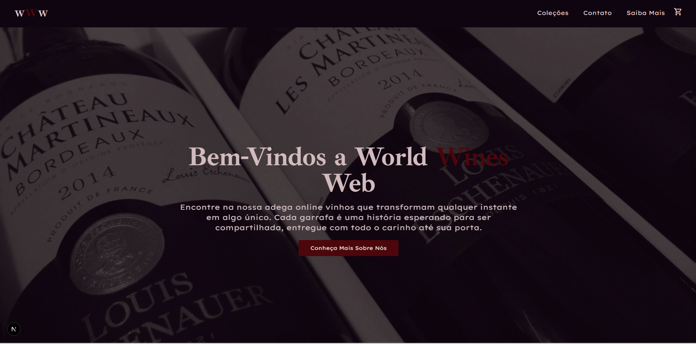

🍷 World Wines Web (WWW)

  

World Wines Web é uma plataforma moderna de e-commerce dedicada à venda de vinhos exclusivos. O projeto foi desenvolvido com foco em uma experiência de usuário (UX) fluida, oferecendo animações suaves, carrinho persistente e uma interface de pagamento interativa e intuitiva.

🚀 Tecnologias Utilizadas
Framework: Next.js 16 (App Router)
Estilização: Tailwind CSS v4
Banco de Dados: Supabase (PostgreSQL)
Ícones: React Icons & Material Symbols
Animações: AOS (Animate On Scroll)
Gerenciamento de Estado: React Context API
✨ Funcionalidades Principais
🛒 Carrinho de Compras Inteligente
Adição e remoção de itens em tempo real
Cálculo automático de totais
Persistência de dados (LocalStorage)
Sidebar moderna com animação deslizante
💳 Página de Pagamento Interativa
Cartão virtual dinâmico
Identificação automática de bandeira (Visa, MasterCard, Elo, Amex)
Máscaras de input para formatação
📱 Design Responsivo
Adaptado para celulares, tablets e desktops
Menu mobile animado
🗄️ Integração com Backend (Supabase)
Leitura de produtos e usuários
Banco de dados relacional (SQL)
🛠️ Como rodar o projeto localmente
1. Clone o repositório
git clone https://github.com/seu-usuario/World-Wine.git
cd World-Wine
2. Instale as dependências
npm install
# ou
yarn install
3. Configure as variáveis de ambiente

Crie um arquivo .env.local:

NEXT_PUBLIC_SUPABASE_URL=your_url
NEXT_PUBLIC_SUPABASE_ANON_KEY=your_key
4. Execute o projeto
npm run dev

Acesse: http://localhost:3000

📌 Observações
Node.js recomendado: 18+
Configure o Supabase antes de rodar